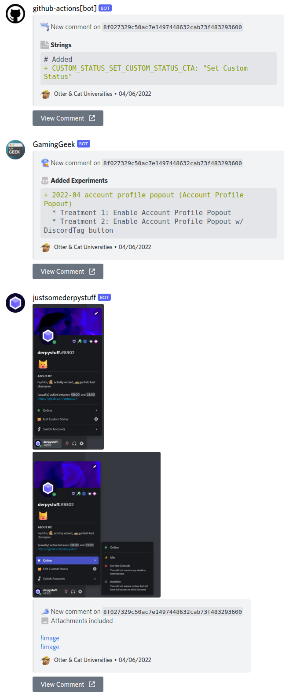

# Datamining Worker

Totally not used a worker template, totally did not use [this template](https://github.com/cloudflare/worker-template/)

My regex hell for a simple middleware for datamining webhooks

Basically,
```plaintext
Github/Discord-Datamining/Discord-Datamining (new comment)
|_ This worker
  |_ Discord (a beautiful embed)
```

Example Commit


